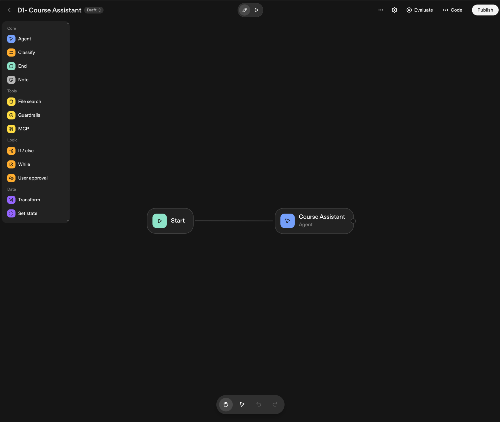
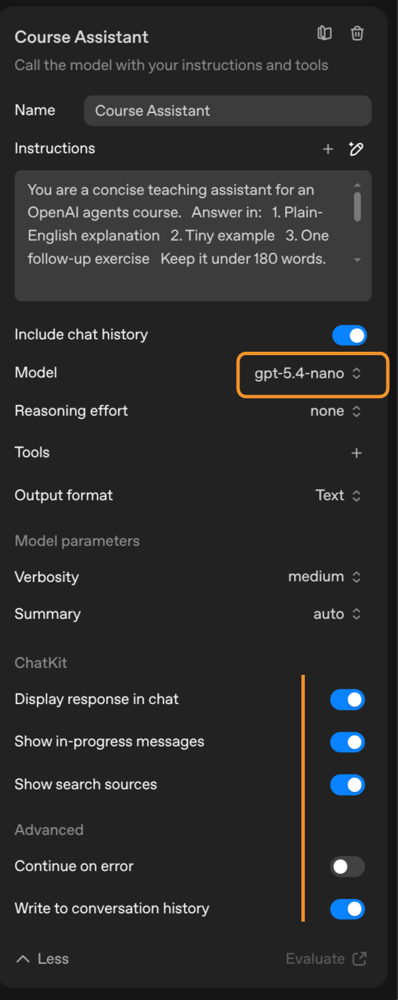

# Demo 1 - Course Assistant

This is the clean introductory Agent Builder demo. It shows the smallest useful workflow: user input goes into one agent, and the agent returns a course-friendly answer.

## Use Case

The assistant answers beginner questions about agents in a concise teaching format.

## Workflow

The finished workflow has two nodes:

```text
Start
  -> Course Assistant
```



This first demo is intentionally minimal. It gives students a clear baseline before later demos add guardrails, classification, branching, File Search, and Transform.

## Start

Use the default chat input:

```text
input_as_text
```

## Course Assistant

Description:

```text
Answers beginner questions about agents in a concise teaching format.
```

Instructions:

```text
You are a concise teaching assistant for an OpenAI agents course.

Answer in:
1. Plain-English explanation
2. Tiny example
3. One follow-up exercise

Keep it under 180 words.
```

Configuration:

- Include chat history: on
- Model: `gpt-5.4-nano`
- Reasoning effort: `none`
- Output format: `Text`
- Verbosity: `medium`
- Summary: `auto`
- Display response in chat: on
- Show in-progress messages: on
- Show search sources: on
- Continue on error: off
- Write to conversation history: on

Message/context:

```text
Student question:
{{workflow.input_as_text}}
```

Use Agent Builder's variable picker for `workflow.input_as_text`. Do not manually type placeholder names unless the UI inserted them.



## Demo Prompt

```text
I'm confused about what agents are compared to normal chatbots.
```

## Expected Behavior

The agent should explain that an agent can reason through a task, use tools, follow workflow logic, and produce an outcome, while a basic chatbot mostly responds directly to messages.

## Teaching Point

Say this while presenting:

```text
This first workflow is intentionally simple. Agent Builder starts with a user message, passes it to an agent node, and returns the agent's answer. Later demos add routing, guardrails, and File Search.
```
