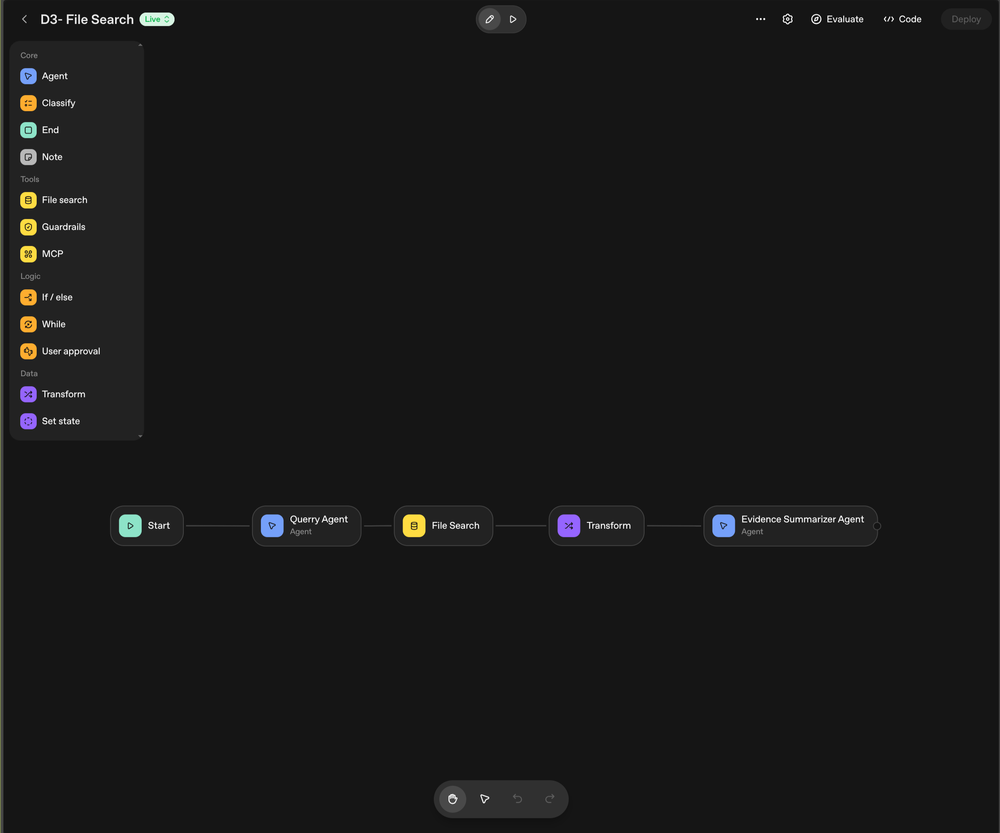
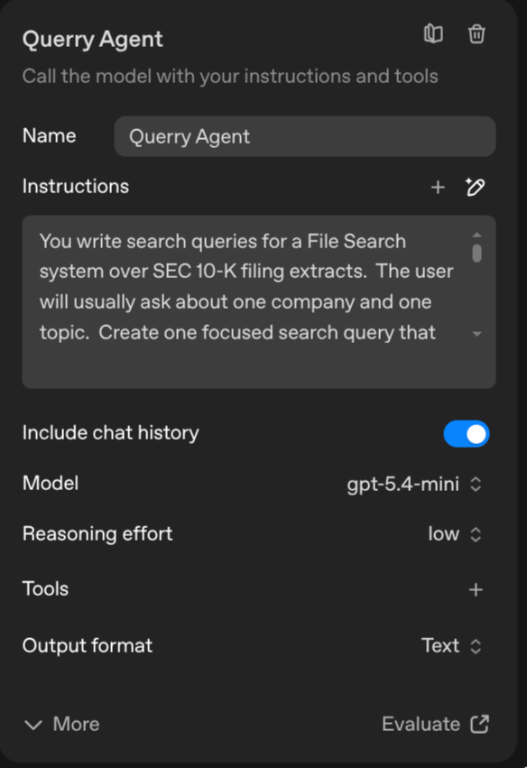
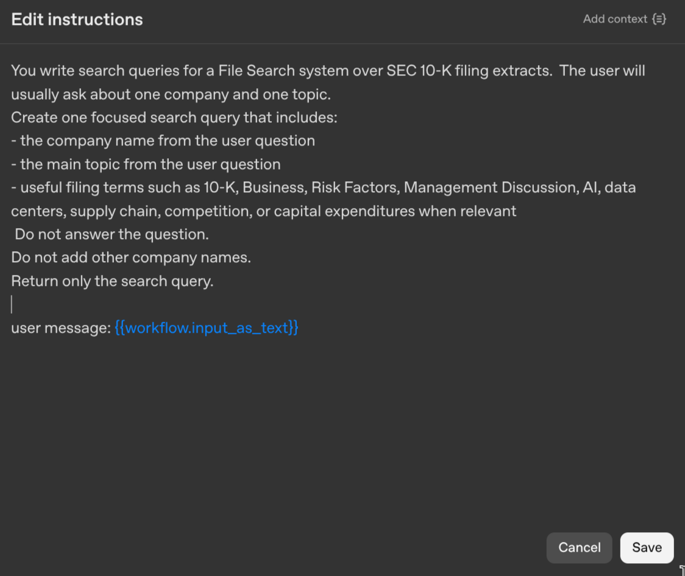
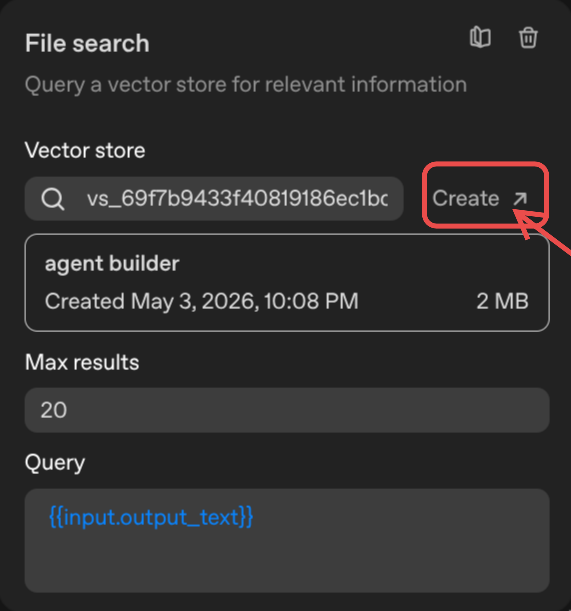
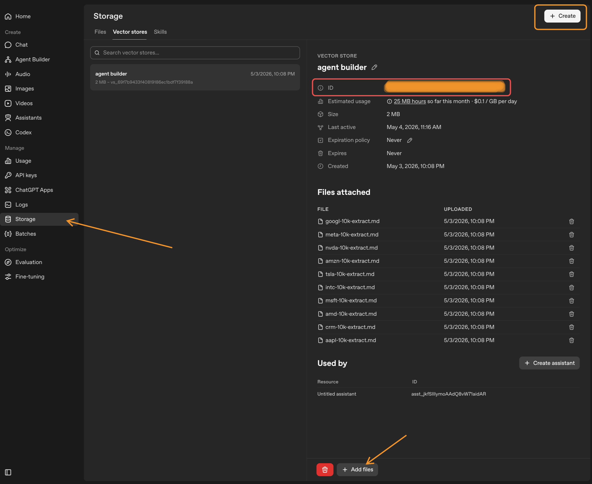
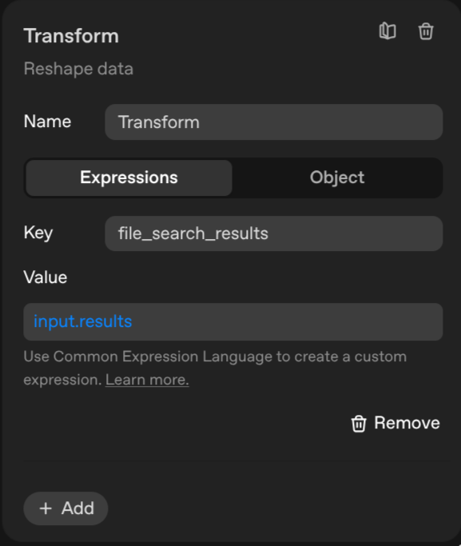
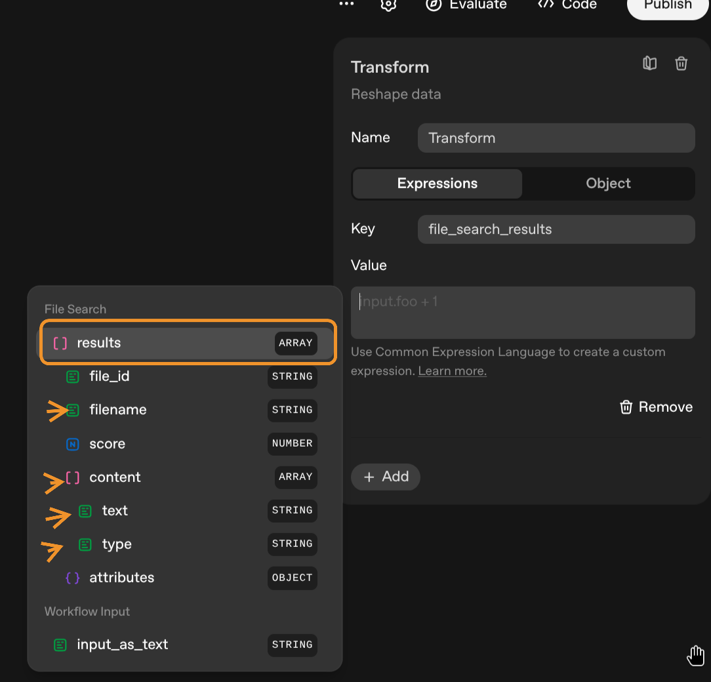
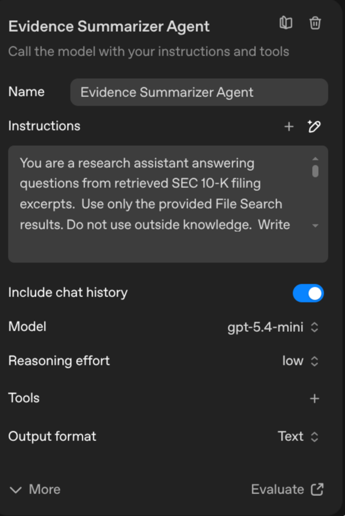
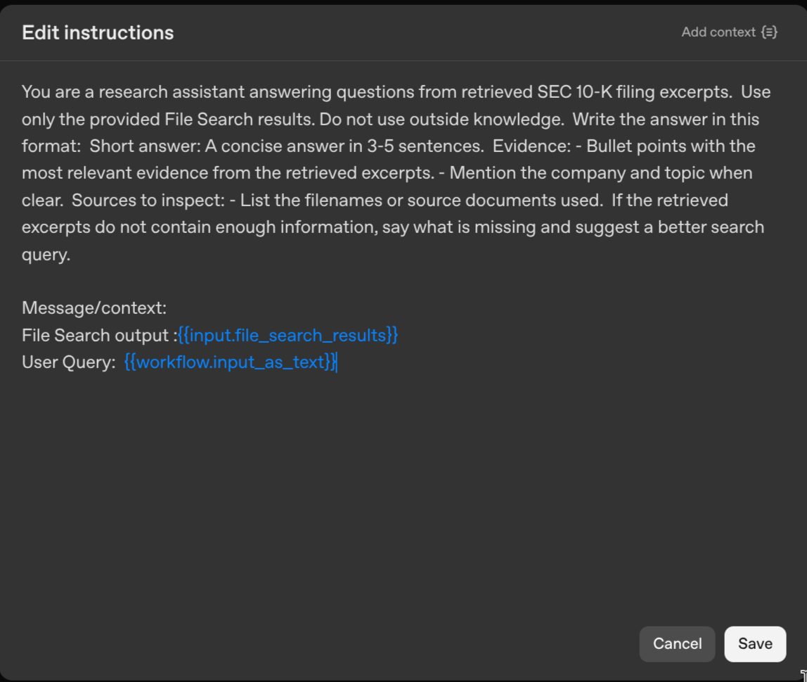

# Module 3 Demo 3 - Simple File Search RAG

This demo shows the built-in File Search/RAG capability in Agent Builder.

The workflow answers questions about uploaded SEC 10-K extracts. It is intentionally simple: one user question, one search query, retrieved document chunks, and a grounded answer with source files.

## Create The Vector Store

Before wiring the workflow, create the vector store that File Search will query.

1. In the OpenAI dashboard, open `Storage`.
2. Select the `Vector stores` tab.
3. Click `Create`.
4. Name the vector store:

```text
agent builder
```

5. Add all Markdown files from:

```text
file-search-docs/
```

The folder contains 10 extracted 10-K files:

- Apple
- AMD
- Amazon
- Alphabet
- Intel
- Meta
- Microsoft
- NVIDIA
- Salesforce
- Tesla


## Demo Prompt

Use one company at a time. This keeps retrieval reliable and makes the demo easier to explain.

```text
What does NVIDIA say about AI data centers and supply chain risks?
```

Other good prompts:

```text
What does Microsoft say about Azure, AI infrastructure, and data centers?
```

```text
What does AMD say about data center GPUs and AI infrastructure?
```

```text
What does Tesla say about supply chain constraints and competition?
```

## Workflow

The finished workflow has five nodes:

```text
Start
  -> Querry Agent
  -> File Search
  -> Transform
  -> Evidence Summarizer Agent
  -> End
```



Side note: File Search returns a list of result objects, not plain text. Agent nodes cannot directly operate on that list as prompt input, so add a Transform node after File Search to convert the retrieved results into a simple type the next agent can read, such as a single text block or simplified JSON object with filenames and excerpt text.

## Querry Agent

Description:

```text
Turns the user's question into a focused search query for the uploaded 10-K filing documents.
```

Instructions:

```text
You write search queries for a File Search system over SEC 10-K filing extracts.

The user will usually ask about one company and one topic.

Create one focused search query that includes:
- the company name from the user question
- the main topic from the user question
- useful filing terms such as 10-K, Business, Risk Factors, Management Discussion, AI, data centers, supply chain, competition, or capital expenditures when relevant

Do not answer the question.
Do not add other company names.
Return only the search query.
```

Message:

```text
user message: {{workflow.input_as_text}}
```

Configuration:

- Include chat history: on
- Model: `gpt-5.4-mini`
- Reasoning effort: `low`
- Output format: `Text`

Example Querry Agent output:

```text
NVIDIA 10-K AI data centers supply chain risks Risk Factors Business Management Discussion
```





## File Search

Description:

```text
Searches the uploaded 10-K filing extracts for relevant passages.
```

Configuration:

- Vector store: `agent builder`
- Query: `{{input.output_text}}`
- Max results: `20`

After running Preview, click the File Search node and confirm it returns chunks from the expected company file, such as `nvda-10k-extract.md`.





After the files are uploaded, copy the vector store ID or confirm the `agent builder` vector store appears in the File Search node.
## Transform

Description:

```text
Extracts the useful text and filenames from the File Search results.
```

This is an important bridge between retrieval and the final answer. File Search returns structured result objects; the Evidence Summarizer Agent needs a prompt-friendly value instead. Use the Transform node to reshape the File Search output into a usable string, list, or simplified JSON object before passing it into the agent.

Use `Expressions` mode with this output:

```text
Key: file_search_results
Value: input.results
```

In this demo, keep the Transform node in the workflow so students see the pattern: whenever File Search feeds an agent, transform the File Search output into a simple list or text block first.

For example, the Transform instructions can combine all retrieved `results[].text` fields into one string separated by newlines, extract only the top result, or keep a compact list of `{filename, text}` items. The goal is to give the agent clean evidence, not the raw File Search object.





## Evidence Summarizer Agent

Description:

```text
Answers the user's question using only the retrieved filing excerpts and lists the source files.
```

Instructions:

```text
You are a research assistant answering questions from retrieved SEC 10-K filing excerpts.

Use only the provided File Search results. Do not use outside knowledge.

Write the answer in this format:

Short answer:
A concise answer in 3-5 sentences.

Evidence:
- Bullet points with the most relevant evidence from the retrieved excerpts.
- Mention the company and topic when clear.

Sources to inspect:
- List the filenames or source documents used.

If the retrieved excerpts do not contain enough information, say what is missing and suggest a better search query.
```

Configuration:

- Include chat history: on
- Model: `gpt-5.4-mini`
- Reasoning effort: `low`
- Output format: `Text`

Message/context:

```text
File Search output: {{input.file_search_results}}
User Query: {{workflow.input_as_text}}
```

Use Agent Builder's variable picker for `input.file_search_results` and `workflow.input_as_text`. Do not manually type placeholder names unless the UI inserted them.




